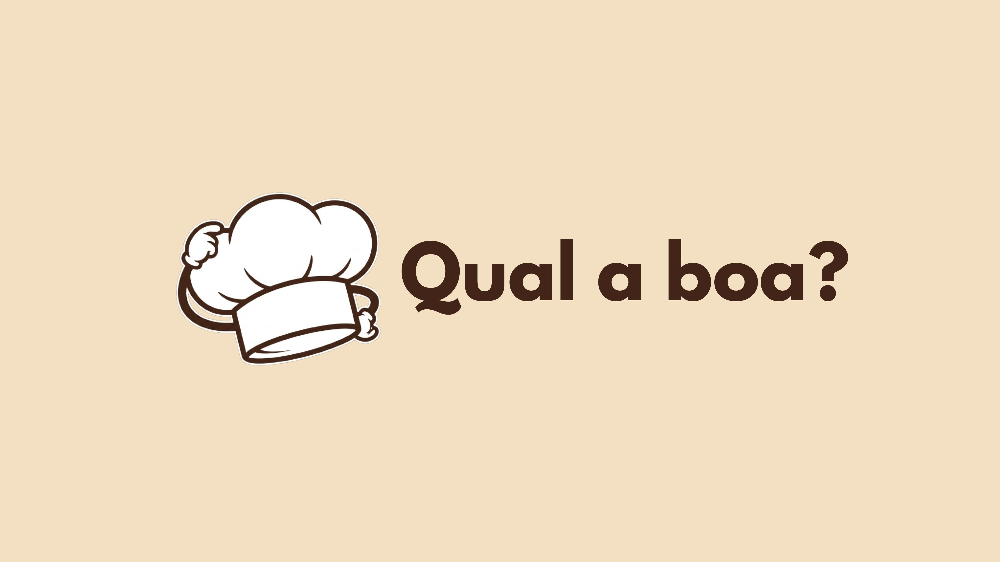

# Qual a Boa?



> Qual a Boa? é um aplicativo mobile para organizar e descobrir suas refeições favoritas. Cadastre pratos por categoria, avalie-os com estrelas, salve links de receitas e deixe a sorte decidir o que comer hoje.

## ➕ Sobre o projeto

O **Qual a Boa?** foi desenvolvido para quem tem dificuldade em decidir o que comer. Com ele, você pode:

- Organizar pratos em categorias personalizadas (ex: Massas, Lanches, Sopas)
- Avaliar cada prato com uma nota de 1 a 5 estrelas
- Salvar links de receitas e anotações de preparo
- Sortear uma refeição aleatória com base na categoria e faixa de nota desejada
- Fazer backup e restauração dos seus dados em JSON
- Alternar entre tema claro e escuro

Todo o armazenamento é feito localmente no dispositivo com **SQLite**, sem necessidade de conta ou internet.

## 🚀 Instalação

Para rodar o projeto localmente, siga os passos abaixo:

```bash
# Clone o repositório
git clone https://github.com/seu-usuario/qual_a_boa.git

# Acesse a pasta do projeto
cd qual_a_boa

# Instale as dependências
npm install

# Configure a variável de ambiente com sua chave do Unsplash
# Crie um arquivo .env na raiz com:
# EXPO_PUBLIC_UNSPLASH_ACCESS_KEY=sua_chave_aqui

# Execute o projeto
npm start
```

> Para obter uma chave da API do Unsplash, crie uma conta em [unsplash.com/developers](https://unsplash.com/developers) e registre um novo aplicativo.

## 🧱 Building

Para gerar um APK de preview com o EAS Build:

```bash
# Certifique-se de ter o EAS CLI instalado e estar logado na sua conta Expo
npm install -g eas-cli
eas login

# Gere o build para Android
eas build -p android --profile preview
```

## ✨ Funcionalidades

- Criar e organizar categorias de pratos com imagens automáticas
- Avaliar pratos com notas de 1 a 5 estrelas
- Salvar links de receitas (incluindo suporte a thumbnails do YouTube)
- Adicionar anotações e ingredientes de cada prato
- Sortear uma refeição aleatória por categoria e faixa de nota
- Busca por nome de prato ou categoria
- Tema claro e escuro com preferência salva no dispositivo
- Exportar e importar backup completo dos dados em JSON

## 🔧 Tecnologias utilizadas

- **React Native** — Framework para desenvolvimento mobile multiplataforma
- **TypeScript** — Tipagem estática para maior segurança no código
- **expo-sqlite** — Banco de dados local SQLite para armazenamento dos pratos e categorias
- **Unsplash API** — Busca automática de imagens para pratos e categorias

## 📝 Licença

Este projeto é de livre utilização para fins de estudo ou como base para outros projetos. Caso utilize, peço gentilmente que mantenha os devidos créditos.
